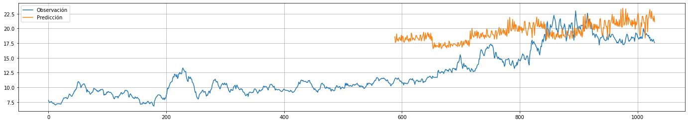

# Comparación de Métodos de Predicción de Series Temporales aplicados a Acciones de MERVAL

Se comparan distintos métodos de predicción de series temporales para un caso de Acciones de MERVAL obtenidas del servicio Yahoo Finance!.

El objetivo es comparar desde métodos clásicos como suavizado exponencial, SARIMA hasta los más recientes como LSTMs y [Prophet](https://facebook.github.io/prophet/) de Facebook.

Cada serie temporal contiene los datos de un período:

- **Apertura (Open)**
- **Alto (High)**
- **Bajo (Low)**
- **Cierre (Close)**
- **Precio de Cierre Ajustado (Adj)**
- **Volumen (Volume)**

Se trata el problema de predicción de una manera general sin aplicar técnicas específicas de modelos matemáticos financieros o conocimientos del dominio financiero o del mercado bursátil, por lo tanto es trasladable a cualquier problema de series temporales univariable.

### Modelos Ensayados

- Suavizado Exponencial: Simple, Doble (Holt), Triple (Holt Winters)
- SARIMA
- LSTM: simple, bidireccional, con autoencoder
- GRU
- CNN
- Facebook Prophet

#### Resultados (sobre primer caso)

|                  |     MSE |    RMSE |     MAE |    MAPE |         R2 | Tiempo de Entrenamiento | Tiempo de Predicción | Descripción                                 |
| :--------------- | ------: | ------: | ------: | ------: | ---------: | ----------------------: | -------------------: | :------------------------------------------ |
| baseline         | 2.16774 | 2.16774 | 1.78711 |  3.5168 | -0.0508735 |                       0 |          0.000340199 | Modelo de base (Persistencia)               |
| SES              | 2.16774 | 2.16774 | 1.78711 |  3.5168 | -0.0508733 |                       0 |            0.0196097 | Suavizado Exponencial Simple                |
| Holt             | 2.19447 | 2.19447 | 1.78725 | 3.50931 | -0.0769559 |                 92.5828 |             0.222562 | Suavizado Exponencial Doble (Holt)          |
| Holt-Winters     | 2.19447 | 2.19447 | 1.78725 | 3.50931 | -0.0769559 |                 4627.34 |              7529.38 | Suavizado Exponencial Triple (Holt-Winters) |
| LSTM             | 4.88927 | 4.88927 | 4.04026 | 8.20058 |   -4.34595 |                 96.4157 |              1.36003 | LSTM (sin reentrenar)                       |
| LSTM-Bi          | 34.8767 | 34.8767 | 34.8144 | 69.5475 |   -271.024 |                 251.067 |              3.38554 | LSTM Bidireccional (sin reentrenar)         |
| GRU              | 3.48786 | 3.48786 | 2.88162 | 5.86472 |   -1.72054 |                 163.034 |              1.26838 | GRU (sin reentrenar)                        |
| LSTM-Autoencoder | 12.4499 | 12.4499 | 11.2867 | 22.4473 |   -33.6631 |                  586.94 |              3.95197 | LSTM Autoencoder (sin reentrenar)           |
| CNN              | 3.04672 | 3.04672 | 2.47797 | 4.93003 |   -1.07589 |                 9.83183 |             0.212735 | CNN (sin reentrenar)                        |
| Prophet          |  3.0961 |  3.0961 | 2.60929 | 5.35421 |   -1.14372 |                 5.33237 |              1.88652 | Prophet (con estacionalidad diaria)         |
| Prophet-NDS      | 3.10631 | 3.10631 | 2.61776 | 5.37194 |   -1.15788 |                 1.57442 |              1.91021 | Prophet (sin estacionalidad diaria)         |

## Casos de Estudio

- [Precios de Cierre de ALUAR Período 2015-2021](TimeSeries_MERVAL_ALUAR_2015_2021.ipynb)